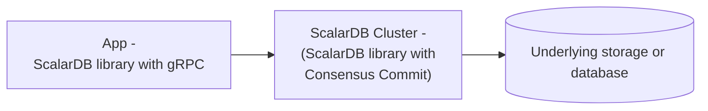

# ScalarDB Cluster Configurations

This document describes the configurations for ScalarDB Cluster. ScalarDB Cluster consists of multiple cluster nodes, each of which needs to be configured. The configurations need to be specified in the properties file.

## Cluster configurations

This section describes the configurations for ScalarDB Cluster.

### General configurations

The following general configurations are available for ScalarDB Cluster.

#### Transaction management configurations

| Name                                                  | Description                                                                                                                                                                                                                                                                                                                                                                                                  | Default            |
|-------------------------------------------------------|--------------------------------------------------------------------------------------------------------------------------------------------------------------------------------------------------------------------------------------------------------------------------------------------------------------------------------------------------------------------------------------------------------------|--------------------|
| `scalar.db.transaction_manager`                       | Transaction manager of ScalarDB. Specify `consensus-commit` to use [Consensus Commit](../consensus-commit.md) or `single-crud-operation` to [run non-transactional storage operations](./run-non-transactional-storage-operations-through-scalardb-cluster.md). Note that the configurations under the `scalar.db.consensus_commit` prefix are ignored if you use `single-crud-operation`.                 | `consensus-commit` |
| `scalar.db.consensus_commit.isolation_level`          | Isolation level used for Consensus Commit. Either `SNAPSHOT`, `SERIALIZABLE`, or `READ_COMMITTED` can be specified.                                                                                                                                                                                                                                                                                          | `SNAPSHOT`         |
| `scalar.db.consensus_commit.coordinator.namespace`    | Namespace name of Coordinator tables used for Consensus Commit.                                                                                                                                                                                                                                                                                                                                                                        | `coordinator`      |

#### Node configurations

| Name                                                               | Description                                                                                         　                                                                                                                                                                                                                      | Default                |
|--------------------------------------------------------------------|----------------------------------------------------------------------------------------------------------------------------------------------------------------------------------------------------------------------------------------------------------------------------------------------------------------------------|------------------------|
| `scalar.db.cluster.membership.type`                                | Membership type. Currently, only `KUBERNETES` can be specified.                                                                                                                                                                                                                                                            | `KUBERNETES`           |
| `scalar.db.cluster.membership.kubernetes.endpoint.namespace_name`  | This configuration is for the `KUBERNETES` membership type. Namespace name for the [endpoint resource](https://kubernetes.io/docs/concepts/services-networking/service/#endpoints).                                                                                                                                        | `default`              |
| `scalar.db.cluster.membership.kubernetes.endpoint.name`            | This configuration is for the `KUBERNETES` membership type. Name of the [endpoint resource](https://kubernetes.io/docs/concepts/services-networking/service/#endpoints) to get the membership info.                                                                                                                        |                        |
| `scalar.db.cluster.node.decommissioning_duration_secs`             | Decommissioning duration in seconds.                                                                                                                                                                                                                                                                                       | `30`                   |
| `scalar.db.cluster.node.grpc.max_inbound_message_size`             | Maximum message size allowed to be received.                                                                                                                                                                                                                                                                               | The gRPC default value |
| `scalar.db.cluster.node.grpc.max_inbound_metadata_size`            | Maximum size of metadata allowed to be received.                                                                                                                                                                                                                                                                           | The gRPC default value |
| `scalar.db.cluster.node.port`                                      | Port number of the ScalarDB Cluster node.                                                                                                                                                                                                                                                                                  | `60053`                |
| `scalar.db.cluster.node.prometheus_exporter_port`                  | Port number of the Prometheus exporter.                                                                                                                                                                                                                                                                                    | `9080`                 |
| `scalar.db.cluster.grpc.deadline_duration_millis`                  | Deadline duration for gRPC in milliseconds.                                                                                                                                                                                                                                                                                | `60000` (60 seconds)   |
| `scalar.db.cluster.node.standalone_mode.enabled`                   | Whether standalone mode is enabled. Note that if standalone mode is enabled, the membership configurations (`scalar.db.cluster.membership.*`) will be ignored.                                                                                                                                                             | `false`                |

### Performance-related configurations

The following performance-related configurations are available for the Consensus Commit transaction manager:

| Name                                                                                   | Description                                                                                                                                                                                                                                                                               | Default                                                           |
|----------------------------------------------------------------------------------------|-------------------------------------------------------------------------------------------------------------------------------------------------------------------------------------------------------------------------------------------------------------------------------------------|-------------------------------------------------------------------|
| `scalar.db.consensus_commit.parallel_executor_count`                                   | Number of executors (threads) for parallel execution. This number refers to the total number of threads across transactions in a ScalarDB Cluster node or a ScalarDB process.                                                                                                             | `128`                                                             |
| `scalar.db.consensus_commit.parallel_preparation.enabled`                              | Whether or not the preparation phase is executed in parallel.                                                                                                                                                                                                                             | `true`                                                            |
| `scalar.db.consensus_commit.parallel_validation.enabled`                               | Whether or not the validation phase (in `EXTRA_READ`) is executed in parallel.                                                                                                                                                                                                            | The value of `scalar.db.consensus_commit.parallel_commit.enabled` |
| `scalar.db.consensus_commit.parallel_commit.enabled`                                   | Whether or not the commit phase is executed in parallel.                                                                                                                                                                                                                                  | `true`                                                            |
| `scalar.db.consensus_commit.parallel_rollback.enabled`                                 | Whether or not the rollback phase is executed in parallel.                                                                                                                                                                                                                                | The value of `scalar.db.consensus_commit.parallel_commit.enabled` |
| `scalar.db.consensus_commit.async_commit.enabled`                                      | Whether or not the commit phase is executed asynchronously.                                                                                                                                                                                                                               | `false`                                                           |
| `scalar.db.consensus_commit.async_rollback.enabled`                                    | Whether or not the rollback phase is executed asynchronously.                                                                                                                                                                                                                             | The value of `scalar.db.consensus_commit.async_commit.enabled`    |
| `scalar.db.consensus_commit.parallel_implicit_pre_read.enabled`                        | Whether or not implicit pre-read is executed in parallel.                                                                                                                                                                                                                                 | `true`                                                            |
| `scalar.db.consensus_commit.coordinator.group_commit.enabled`                          | Whether or not committing the transaction state is executed in batch mode. This feature can't be used with a two-phase commit interface.                                                                                                                                                  | `false`                                                           |
| `scalar.db.consensus_commit.coordinator.group_commit.slot_capacity`                    | Maximum number of slots in a group for the group commit feature. A large value improves the efficiency of group commit, but may also increase latency and the likelihood of transaction conflicts.[^1]                                                                                    | `20`                                                              |
| `scalar.db.consensus_commit.coordinator.group_commit.group_size_fix_timeout_millis`    | Timeout to fix the size of slots in a group. A large value improves the efficiency of group commit, but may also increase latency and the likelihood of transaction conflicts.[^1]                                                                                                        | `40`                                                              |
| `scalar.db.consensus_commit.coordinator.group_commit.delayed_slot_move_timeout_millis` | Timeout to move delayed slots from a group to another isolated group to prevent the original group from being affected by delayed transactions. A large value improves the efficiency of group commit, but may also increase the latency and the likelihood of transaction conflicts.[^1] | `1200`                                                            |
| `scalar.db.consensus_commit.coordinator.group_commit.old_group_abort_timeout_millis`   | Timeout to abort an old ongoing group. A small value reduces resource consumption through aggressive aborts, but may also increase the likelihood of unnecessary aborts for long-running transactions.                                                                                    | `60000`                                                           |
| `scalar.db.consensus_commit.coordinator.group_commit.timeout_check_interval_millis`    | Interval for checking the group commit–related timeouts.                                                                                                                                                                                                                                  | `20`                                                              |
| `scalar.db.consensus_commit.coordinator.group_commit.metrics_monitor_log_enabled`      | Whether or not the metrics of the group commit are logged periodically.                                                                                                                                                                                                                   | `false`                                                           |

### Storage-related configurations

ScalarDB has a storage (database) abstraction layer that supports multiple storage implementations. You can specify the storage implementation by using the `scalar.db.storage` property.

Select a database to see the configurations available for each storage.

**JDBC databases**

The following configurations are available for JDBC databases:

| Name                                                      | Description                                                                                                                                                                  | Default                      |
|-----------------------------------------------------------|------------------------------------------------------------------------------------------------------------------------------------------------------------------------------|------------------------------|
| `scalar.db.storage`                                       | `jdbc` must be specified.                                                                                                                                                    | -                            |
| `scalar.db.contact_points`                                | JDBC connection URL.                                                                                                                                                         |                              |
| `scalar.db.username`                                      | Username to access the database.                                                                                                                                             |                              |
| `scalar.db.password`                                      | Password to access the database.                                                                                                                                             |                              |
| `scalar.db.jdbc.connection_pool.min_idle`                 | Minimum number of idle connections in the connection pool.                                                                                                                   | `20`                         |
| `scalar.db.jdbc.connection_pool.max_idle`                 | Maximum number of connections that can remain idle in the connection pool.                                                                                                   | `50`                         |
| `scalar.db.jdbc.connection_pool.max_total`                | Maximum total number of idle and borrowed connections that can be active at the same time for the connection pool. Use a negative value for no limit.                        | `200`                        |
| `scalar.db.jdbc.prepared_statements_pool.enabled`         | Setting this property to `true` enables prepared-statement pooling.                                                                                                          | `false`                      |
| `scalar.db.jdbc.prepared_statements_pool.max_open`        | Maximum number of open statements that can be allocated from the statement pool at the same time. Use a negative value for no limit.                                         | `-1`                         |
| `scalar.db.jdbc.isolation_level`                          | Isolation level for JDBC. `READ_UNCOMMITTED`, `READ_COMMITTED`, `REPEATABLE_READ`, or `SERIALIZABLE` can be specified.                                                       | Underlying-database specific |
| `scalar.db.jdbc.table_metadata.connection_pool.min_idle`  | Minimum number of idle connections in the connection pool for the table metadata.                                                                                            | `5`                          |
| `scalar.db.jdbc.table_metadata.connection_pool.max_idle`  | Maximum number of connections that can remain idle in the connection pool for the table metadata.                                                                            | `10`                         |
| `scalar.db.jdbc.table_metadata.connection_pool.max_total` | Maximum total number of idle and borrowed connections that can be active at the same time for the connection pool for the table metadata. Use a negative value for no limit. | `25`                         |
| `scalar.db.jdbc.admin.connection_pool.min_idle`           | Minimum number of idle connections in the connection pool for admin.                                                                                                         | `5`                          |
| `scalar.db.jdbc.admin.connection_pool.max_idle`           | Maximum number of connections that can remain idle in the connection pool for admin.                                                                                         | `10`                         |
| `scalar.db.jdbc.admin.connection_pool.max_total`          | Maximum total number of idle and borrowed connections that can be active at the same time for the connection pool for admin. Use a negative value for no limit.              | `25`                         |

:::note

If you're using SQLite3 as a JDBC database, you must set `scalar.db.contact_points` as follows:

```properties
scalar.db.contact_points=jdbc:sqlite:<SQLITE_DB_FILE_PATH>?busy_timeout=10000
```

Unlike other JDBC databases, [SQLite3 doesn't fully support concurrent access](https://www.sqlite.org/lang_transaction.html).
To avoid frequent errors caused internally by [`SQLITE_BUSY`](https://www.sqlite.org/rescode.html#busy), we recommend setting a [`busy_timeout`](https://www.sqlite.org/c3ref/busy_timeout.html) parameter.

:::

**DynamoDB**

The following configurations are available for DynamoDB:

| Name                                  | Description                                                                                                                                                                                                                                                 | Default    |
|---------------------------------------|-------------------------------------------------------------------------------------------------------------------------------------------------------------------------------------------------------------------------------------------------------------|------------|
| `scalar.db.storage`                   | `dynamo` must be specified.                                                                                                                                                                                                                                 | -          |
| `scalar.db.contact_points`            | AWS region with which ScalarDB should communicate (e.g., `us-east-1`).                                                                                                                                                                                      |            |
| `scalar.db.username`                  | AWS access key used to identify the user interacting with AWS.                                                                                                                                                                                              |            |
| `scalar.db.password`                  | AWS secret access key used to authenticate the user interacting with AWS.                                                                                                                                                                                   |            |
| `scalar.db.dynamo.endpoint_override`  | Amazon DynamoDB endpoint with which ScalarDB should communicate. This is primarily used for testing with a local instance instead of an AWS service.                                                                                                        |            |
| `scalar.db.dynamo.namespace.prefix`   | Prefix for the user namespaces and metadata namespace names. Since AWS requires having unique tables names in a single AWS region, this is useful if you want to use multiple ScalarDB environments (development, production, etc.) in a single AWS region. |            |

**Cosmos DB for NoSQL**

The following configurations are available for CosmosDB for NoSQL:

| Name                                 | Description                                                                                              | Default  |
|--------------------------------------|----------------------------------------------------------------------------------------------------------|----------|
| `scalar.db.storage`                  | `cosmos` must be specified.                                                                              | -        |
| `scalar.db.contact_points`           | Azure Cosmos DB for NoSQL endpoint with which ScalarDB should communicate.                               |          |
| `scalar.db.password`                 | Either a master or read-only key used to perform authentication for accessing Azure Cosmos DB for NoSQL. |          |
| `scalar.db.cosmos.consistency_level` | Consistency level used for Cosmos DB operations. `STRONG` or `BOUNDED_STALENESS` can be specified.       | `STRONG` |

**Cassandra**

The following configurations are available for Cassandra:

| Name                                    | Description                                                           | Default    |
|-----------------------------------------|-----------------------------------------------------------------------|------------|
| `scalar.db.storage`                     | `cassandra` must be specified.                                        | -          |
| `scalar.db.contact_points`              | Comma-separated contact points.                                       |            |
| `scalar.db.contact_port`                | Port number for all the contact points.                               |            |
| `scalar.db.username`                    | Username to access the database.                                      |            |
| `scalar.db.password`                    | Password to access the database.                                      |            |

#### Multi-storage support

ScalarDB supports using multiple storage implementations simultaneously. You can use multiple storages by specifying `multi-storage` as the value for the `scalar.db.storage` property.

For details about using multiple storages, see [Multi-Storage Transactions](../multi-storage-transactions.md).

#### Cross-partition scan configurations

By enabling the cross-partition scan option as described below, the `Scan` operation can retrieve all records across partitions. In addition, you can specify arbitrary conditions and orderings in the cross-partition `Scan` operation by enabling `cross_partition_scan.filtering` and `cross_partition_scan.ordering`, respectively. Currently, the cross-partition scan with ordering option is available only for JDBC databases. To enable filtering and ordering, `scalar.db.cross_partition_scan.enabled` must be set to `true`.

For details on how to use cross-partition scan, see [Scan operation](../api-guide.md#scan-operation).

:::warning

For non-JDBC databases, we do not recommend enabling cross-partition scan with the `SERIALIAZABLE` isolation level because transactions could be executed at a lower isolation level (that is, `SNAPSHOT`). When using non-JDBC databases, use cross-partition scan at your own risk only if consistency does not matter for your transactions.

:::

| Name                                               | Description                                   | Default |
|----------------------------------------------------|-----------------------------------------------|---------|
| `scalar.db.cross_partition_scan.enabled`           | Enable cross-partition scan.                  | `true`  |
| `scalar.db.cross_partition_scan.filtering.enabled` | Enable filtering in cross-partition scan.     | `false` |
| `scalar.db.cross_partition_scan.ordering.enabled`  | Enable ordering in cross-partition scan.      | `false` |

### GraphQL-related configurations

The configurations for ScalarDB Cluster GraphQL are as follows:

| Name                                                | Description                                                                                                                                 | Default              |
|-----------------------------------------------------|---------------------------------------------------------------------------------------------------------------------------------------------|----------------------|
| `scalar.db.graphql.enabled`                         | Whether ScalarDB Cluster GraphQL is enabled.                                                                                                | `false`              |
| `scalar.db.graphql.port`                            | Port number of the GraphQL server.                                                                                                          | `8080`               |
| `scalar.db.graphql.path`                            | Path component of the URL of the GraphQL endpoint.                                                                                          | `/graphql`           |
| `scalar.db.graphql.namespaces`                      | Comma-separated list of namespaces of tables for which the GraphQL server generates a schema. Note that at least one namespace is required. |                      |
| `scalar.db.graphql.graphiql`                        | Whether the GraphQL server serves [GraphiQL](https://github.com/graphql/graphiql) IDE.                                                      | `true`               |
| `scalar.db.graphql.schema_checking_interval_millis` | Interval in milliseconds at which GraphQL server will rebuild the GraphQL schema if any change is detected in the ScalarDB schema.          | `30000` (30 seconds) |

#### Creating or modifying the ScalarDB schema when the server is running

Since the GraphQL schema is statically built at server startup, if the ScalarDB schema is modified (for example, if a table is added, altered, or deleted), then the corresponding GraphQL schema won't reflect the changes unless it is rebuilt. To address this, the GraphQL server provides two mechanisms: a periodic check and an on-demand check.

##### Run periodic checks

The server periodically checks if changes in the ScalarDB schema occur and rebuilds the corresponding GraphQL schema if necessary. By default, the check occurs every 30 seconds, but the interval can be configured by using the `scalar.db.graphql.schema_checking_interval_millis` property.

If you don't need to run periodic checks, you can disable it by setting the property value to `-1`.

##### Run on-demand checks

You can also request the server to check changes in the ScalarDB schema and rebuild the corresponding GraphQL schema if necessary by performing a POST request to the `/update-graphql-schema` endpoint of the HTTP API.

For example, if the HTTP API is running on `localhost:8080` and the `scalar.db.graphql.path` property is set to `/graphql`, this endpoint can be called by running the following command:

```console
curl -X POST http://localhost:8080/graphql/update-graphql-schema
```

### SQL-related configurations

The configurations for ScalarDB Cluster SQL are as follows:

| Name                                     | Description                                                                                              | Default       |
|------------------------------------------|----------------------------------------------------------------------------------------------------------|---------------|
| `scalar.db.sql.enabled`                  | Whether ScalarDB Cluster SQL is enabled.                                                                 | `false`       |
| `scalar.db.sql.statement_cache.enabled`  | Enable the statement cache.                                                                              | `false`       |
| `scalar.db.sql.statement_cache.size`     | Maximum number of cached statements.                                                                     | `100`         |
| `scalar.db.sql.default_transaction_mode` | Default transaction mode. `TRANSACTION` or `TWO_PHASE_COMMIT_TRANSACTION` can be set.                    | `TRANSACTION` |
| `scalar.db.sql.default_namespace_name`   | Default namespace name. If you don't specify a namespace name in your SQL statement, this value is used. |               |

## Other ScalarDB Cluster configurations

The following are additional configurations available for ScalarDB Cluster:

| Name                                                             | Description                                                                                                                                                                                                                                                                                                                                                                                                  | Default              |
|------------------------------------------------------------------|--------------------------------------------------------------------------------------------------------------------------------------------------------------------------------------------------------------------------------------------------------------------------------------------------------------------------------------------------------------------------------------------------------------|----------------------|
| `scalar.db.metadata.cache_expiration_time_secs`                  | ScalarDB has a metadata cache to reduce the number of requests to the database. This setting specifies the expiration time of the cache in seconds. If you specify `-1`, the cache will never expire.                                                                                                                                                                                                        | `60`                 |
| `scalar.db.active_transaction_management.expiration_time_millis` | ScalarDB maintains in-progress transactions, which can be resumed by using a transaction ID. This process expires transactions that have been idle for an extended period to prevent resource leaks. This setting specifies the expiration time of this transaction management feature in milliseconds.                                                                                                      | `60000` (60 seconds) |
| `scalar.db.consensus_commit.include_metadata.enabled`            | When using Consensus Commit, if this is set to `true`, `Get` and `Scan` operations results will contain transaction metadata. To see the transaction metadata columns details for a given table, you can use the `DistributedTransactionAdmin.getTableMetadata()` method, which will return the table metadata augmented with the transaction metadata columns. Using this configuration can be useful to investigate transaction-related issues. | `false`              |
| `scalar.db.default_namespace_name`                               | The given namespace name will be used by operations that do not already specify a namespace.                                                                                                                                                                                                                                                                                                                 |                      |

## Client configurations

This section describes the general configurations for the ScalarDB Cluster client.

### Configurations for the primitive interface

The following table shows the general configurations for the ScalarDB Cluster client.

| Name                                               | Description                                                                                                                                                                                                                                                                                                                                                                                                                                                                                                                                                                                                                                                            | Default                |
|----------------------------------------------------|------------------------------------------------------------------------------------------------------------------------------------------------------------------------------------------------------------------------------------------------------------------------------------------------------------------------------------------------------------------------------------------------------------------------------------------------------------------------------------------------------------------------------------------------------------------------------------------------------------------------------------------------------------------------|------------------------|
| `scalar.db.transaction_manager`                    | `cluster` should be specified.                                                                                                                                                                                                                                                                                                                                                                                                                                                                                                                                                                                                                                         | -                      |
| `scalar.db.contact_points`                         | Contact point of the cluster. If you use the `indirect` client mode, specify the IP address of the load balancer in front of your cluster nodes by using the format `indirect:<the load balancer IP address>`. If you use the `direct-kubernetes` client mode, specify the namespace name (optional) and the name of the [endpoint resource](https://kubernetes.io/docs/concepts/services-networking/service/#endpoints) to get the membership information by using the format `direct-kubernetes:<namespace name>/<endpoint name>` or just `direct-kubernetes:<endpoint name>`. If you don't specify the namespace name, the client will use the `default` namespace. |                        |
| `scalar.db.contact_port`                           | Port number for the contact point.                                                                                                                                                                                                                                                                                                                                                                                                                                                                                                                                                                                                                                     | `60053`                |
| `scalar.db.cluster.grpc.deadline_duration_millis`  | Deadline duration for gRPC in millis.                                                                                                                                                                                                                                                                                                                                                                                                                                                                                                                                                                                                                                  | `60000` (60 seconds)   |
| `scalar.db.cluster.grpc.max_inbound_message_size`  | Maximum message size allowed for a single gRPC frame.                                                                                                                                                                                                                                                                                                                                                                                                                                                                                                                                                                                                                  | The gRPC default value |
| `scalar.db.cluster.grpc.max_inbound_metadata_size` | Maximum size of metadata allowed to be received.                                                                                                                                                                                                                                                                                                                                                                                                                                                                                                                                                                                                                       | The gRPC default value |

For example, if you use the `indirect` client mode and the load balancer IP address is `192.168.10.1`, you can configure the client as follows:

```properties
scalar.db.transaction_manager=cluster
scalar.db.contact_points=indirect:192.168.10.1
```

Or if you use the `direct-kubernetes` client mode, with the namespace of the endpoint as `ns` and the endpoint name as `scalardb-cluster`, you can configure the client as follows:

```properties
scalar.db.transaction_manager=cluster
scalar.db.contact_points=direct-kubernetes:ns/scalardb-cluster
```

### Configurations for the SQL interface

The following table shows the configurations for the ScalarDB Cluster SQL client.

| Name                                               | Description                                                                                                                                                                                                                                                                                                                                                                                                                                                                                                                                                                                                                                                            | Default                |
|----------------------------------------------------|------------------------------------------------------------------------------------------------------------------------------------------------------------------------------------------------------------------------------------------------------------------------------------------------------------------------------------------------------------------------------------------------------------------------------------------------------------------------------------------------------------------------------------------------------------------------------------------------------------------------------------------------------------------------|------------------------|
| `scalar.db.sql.connection_mode`                    | `cluster` should be specified.                                                                                                                                                                                                                                                                                                                                                                                                                                                                                                                                                                                                                                         | -                      |
| `scalar.db.sql.cluster_mode.contact_points`        | Contact point of the cluster. If you use the `indirect` client mode, specify the IP address of the load balancer in front of your cluster nodes by using the format `indirect:<the load balancer IP address>`. If you use the `direct-kubernetes` client mode, specify the namespace name (optional) and the name of the [endpoint resource](https://kubernetes.io/docs/concepts/services-networking/service/#endpoints) to get the membership information by using the format `direct-kubernetes:<namespace name>/<endpoint name>` or just `direct-kubernetes:<endpoint name>`. If you don't specify the namespace name, the client will use the `default` namespace. |                        |
| `scalar.db.sql.cluster_mode.contact_port`          | Port number for the contact point.                                                                                                                                                                                                                                                                                                                                                                                                                                                                                                                                                                                                                                     | `60053`                |
| `scalar.db.sql.default_transaction_mode`           | Default transaction mode. `TRANSACTION` or `TWO_PHASE_COMMIT_TRANSACTION` can be set.                                                                                                                                                                                                                                                                                                                                                                                                                                                                                                                                                                                  | `TRANSACTION`          |
| `scalar.db.sql.default_namespace_name`             | Default namespace name. If you don't specify a namespace name in your SQL statement, this value is used.                                                                                                                                                                                                                                                                                                                                                                                                                                                                                                                                                               |                        |
| `scalar.db.cluster.grpc.deadline_duration_millis`  | Deadline duration for gRPC in millis.                                                                                                                                                                                                                                                                                                                                                                                                                                                                                                                                                                                                                                  | `60000` (60 seconds)   |
| `scalar.db.cluster.grpc.max_inbound_message_size`  | Maximum message size allowed for a single gRPC frame.                                                                                                                                                                                                                                                                                                                                                                                                                                                                                                                                                                                                                  | The gRPC default value |
| `scalar.db.cluster.grpc.max_inbound_metadata_size` | Maximum size of metadata allowed to be received.                                                                                                                                                                                                                                                                                                                                                                                                                                                                                                                                                                                                                       | The gRPC default value |

For example, if you use the `indirect` client mode and the load balancer IP address is `192.168.10.1`, you can configure the client as follows:

```properties
scalar.db.sql.connection_mode=cluster
scalar.db.sql.cluster_mode.contact_points=indirect:192.168.10.1
```

Or if you use the `direct-kubernetes` client mode, with the namespace of the endpoint as `ns` and the endpoint name as `scalardb-cluster`, you can configure the client as follows:

```properties
scalar.db.sql.connection_mode=cluster
scalar.db.sql.cluster_mode.contact_points=direct-kubernetes:ns/scalardb-cluster
```

For details about how to configure ScalarDB JDBC, see [JDBC connection URL](../scalardb-sql/jdbc-guide.md#jdbc-connection-url).

For details about how to configure Spring Data JDBC for ScalarDB, see [Configurations](../scalardb-sql/spring-data-guide.md#configurations).

## Configuration example - App, ScalarDB Cluster, and database



In this example configuration, the app (ScalarDB library with gRPC) connects to an underlying storage or database (in this case, Cassandra) through ScalarDB Cluster, which is a component that is available only in the ScalarDB Enterprise edition.

:::note

This configuration is acceptable for production use because ScalarDB Cluster implements the [Scalar Admin](https://github.com/scalar-labs/scalar-admin) interface, which enables you to take transactionally consistent backups for ScalarDB by pausing ScalarDB Cluster.

:::

The following is an example of the configuration for connecting the app to the underlying database through ScalarDB Cluster:

```properties
# Transaction manager implementation.
scalar.db.transaction_manager=cluster

# Contact point of the cluster.
scalar.db.contact_points=indirect:<SCALARDB_CLUSTER_CONTACT_POINT>
```

For details about client configurations, see the [ScalarDB Cluster client configurations](#client-configurations).

[^1]: It's worth benchmarking the performance with a few variations (for example, 75% and 125% of the default value) on the same underlying storage that your application uses, considering your application's access pattern, to determine the optimal configuration as it really depends on those factors. Also, it's important to benchmark combinations of these parameters (for example, first, `slot_capacity:20` and `group_size_fix_timeout_millis:40`; second, `slot_capacity:30` and `group_size_fix_timeout_millis:40`; and third, `slot_capacity:20` and `group_size_fix_timeout_millis:80`) to determine the optimal combination.
