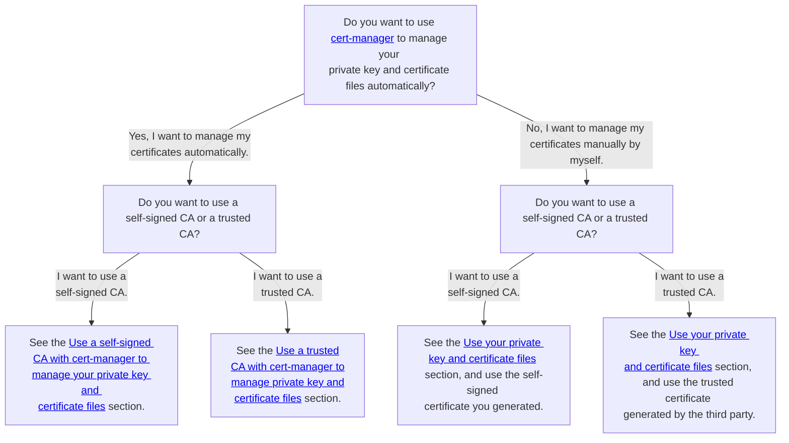

# Configure a custom values file for ScalarDB Analytics server

This document explains how to create your custom values file for the ScalarDB Analytics server chart. For details on the parameters, see the [README](https://github.com/scalar-labs/helm-charts/blob/main/charts/scalardb-analytics-server/README.md) of the ScalarDB Analytics server chart.

## Required configurations

This section describes the required image, database, and service configurations.

### Image configurations

You must set `scalarDbAnalyticsServer.image.repository`. Be sure to specify the ScalarDB Analytics server container image so that you can pull the image from the container repository.

```yaml
scalarDbAnalyticsServer:
  image:
    repository: <SCALARDB_ANALYTICS_SERVER_CONTAINER_IMAGE>
```

### Database configurations

You must set `scalarDbAnalyticsServer.properties`. For details about configuring the value of this parameter, see [ScalarDB Analytics server configuration](https://scalardb.scalar-labs.com/docs/latest/scalardb-analytics/configuration).

```yaml
scalarDbAnalyticsServer:
  properties: |
    scalar.db.analytics.server.db.url=jdbc:postgresql://localhost:5432/scalardb_analytics
    scalar.db.analytics.server.db.username=analytics_user
    scalar.db.analytics.server.db.password=your_secure_password
```

### Service configurations

You must set `scalarDbAnalyticsServer.service.type` to specify the Service resource type of Kubernetes.

If the ScalarDB Analytics server accepts client requests from inside of the Kubernetes cluster only (for example, if you deploy your client applications on the same Kubernetes cluster as Scalar products), you can set `scalarDbAnalyticsServer.service.type` to `ClusterIP`. This configuration doesn't create any load balancers provided by cloud service providers.

```yaml
scalarDbAnalyticsServer:
  service:
    type: ClusterIP
```

If you want to use a load balancer provided by a cloud service provider to accept client requests from outside of the Kubernetes cluster, you need to set `scalarDbAnalyticsServer.service.type` to `LoadBalancer`.

```yaml
scalarDbAnalyticsServer:
  service:
    type: LoadBalancer
```

If you want to configure the load balancer via annotations, you can also set annotations to `scalarDbAnalyticsServer.service.annotations`.

```yaml
scalarDbAnalyticsServer:
  service:
    type: LoadBalancer
    annotations:
      service.beta.kubernetes.io/aws-load-balancer-internal: "true"
      service.beta.kubernetes.io/aws-load-balancer-type: "nlb"
```

## Optional configurations

This section describes the optional configurations.

### Secret configurations (recommended in production environments)

To use environment variables to set some properties (for example, credentials), you can use `scalarDbAnalyticsServer.secretName` to specify the Secret resource that includes some credentials.

For example, you can set credentials for a backend database (`scalar.db.analytics.server.db.username` and `scalar.db.analytics.server.db.password`) by using environment variables, which makes your pods more secure.

```yaml
scalarDbAnalyticsServer:
  secretName: "scalardb-analytics-server-credentials-secret"
```

:::tip

The ScalarDB Analytics server automatically loads configurations from specific environment variables. The naming rule for the environment variables is as follows:

- Capitalize all characters of the property name.
- Replace periods (`.`) with underscores (`_`).

For example, if you want to set `scalar.db.analytics.server.db.username` and `scalar.db.analytics.server.db.password` via environment variables, you must set environment variables `SCALAR_DB_ANALYTICS_SERVER_DB_USERNAME` and `SCALAR_DB_ANALYTICS_SERVER_DB_PASSWORD`.

In this case, you don't need to set `scalar.db.analytics.server.db.username` and `scalar.db.analytics.server.db.password` in `scalarDbAnalyticsServer.properties`. Setting only the environment variables is enough.

For example, you can create such a secret resource that includes `SCALAR_DB_ANALYTICS_SERVER_DB_USERNAME` and `SCALAR_DB_ANALYTICS_SERVER_DB_PASSWORD` as follows:

```console
kubectl create secret generic scalardb-analytics-server-credentials-secret \
  --from-literal=SCALAR_DB_ANALYTICS_SERVER_DB_USERNAME=analytics_user \
  --from-literal=SCALAR_DB_ANALYTICS_SERVER_DB_PASSWORD=your_secure_password
```

:::

### SecurityContext configurations (the default value is recommended)

To set SecurityContext and PodSecurityContext for ScalarDB Analytics server pods, you can use `scalarDbAnalyticsServer.securityContext` and `scalarDbAnalyticsServer.podSecurityContext`.

You can configure SecurityContext and PodSecurityContext by using the same syntax as SecurityContext and PodSecurityContext in Kubernetes. For more details on the SecurityContext and PodSecurityContext configurations in Kubernetes, see [Configure a Security Context for a Pod or Container](https://kubernetes.io/docs/tasks/configure-pod-container/security-context/).

```yaml
scalarDbAnalyticsServer:
  podSecurityContext:
    seccompProfile:
      type: RuntimeDefault
  securityContext:
    capabilities:
      drop:
        - ALL
    runAsNonRoot: true
    allowPrivilegeEscalation: false
```

### TLS configurations (optional based on your environment)

You can enable TLS in:

- The communications between the ScalarDB Analytics server and its client.

You have several options for certificate management:

1. Management of private key and certificate files
   1. Manage your private key and certificate files automatically by using [cert-manager](https://cert-manager.io/docs/).
- This method can reduce maintenance or operation costs. For example, cert-manager automatically renews certificates before they expire and Scalar Helm Chart automatically mounts private key and certificate files on the Scalar product pods.
- You cannot use a CA that cert-manager does not support. You can see the supported issuers in the [cert-manager documentation](https://cert-manager.io/docs/configuration/issuers/).
   1. Manage your private key and certificate files manually.
- You can issue and manage your private key and certificate files on your own by using your preferred method.
- You can use any certificate even if cert-manager does not support it.
- You must update secret resources when certificates expire.
1. Kinds of certificates
   1. Use a trusted CA (signed certificate by third party).
- You can use trusted certificates from a third-party certificate issuer.
- You can encrypt packets.
- You must pay costs to issue trusted certificates.
   1. Use self-signed certificates.
- You can reduce costs to issue certificates.
- Reliability of certificates is lower than a trusted CA, but you can encrypt packets.

In other words, you have the following four options:

1. Use a self-signed CA with automatic management.
1. Use a trusted CA with automatic management.
1. Use a self-signed CA with manual management.
1. Use a trusted CA with manual management.

You should consider which method to use based on your security requirements. For guidance and related documentation for each method, refer to the following decision tree:



#### Enable TLS

You can enable TLS in all ScalarDB Analytics server connections by using the following configurations:

```yaml
scalarDbAnalyticsServer:
  properties: |
    ...(omit)...
    scalar.db.analytics.server.tls.enabled=true
    scalar.db.analytics.server.tls.cert_chain_path=/tls/scalardb-analytics-server/certs/tls.crt
    scalar.db.analytics.server.tls.private_key_path=/tls/scalardb-analytics-server/certs/tls.key
  tls:
    enabled: true
```

:::note

Based on the specification of the private key and certificate that are created by cert-manager and the specification of this chart, you must set the fixed file path and file name when you enable the TLS feature. Please set the above file paths and file names as is for `scalar.db.analytics.server.tls.cert_chain_path` and `scalar.db.analytics.server.tls.private_key_path`.

:::

##### Use your private key and certificate files

You can set your private key and certificate files by using the following configurations:

```yaml
scalarDbAnalyticsServer:
  tls:
    enabled: true
    caRootCertSecret: "scalardb-analytics-server-tls-ca"
    certChainSecret: "scalardb-analytics-server-tls-cert"
    privateKeySecret: "scalardb-analytics-server-tls-key"
```

In this case, you have to create secret resources that include private key and certificate files for the ScalarDB Analytics server as follows, replacing the contents in the angle brackets as described:

```console
kubectl create secret generic scalardb-analytics-server-tls-ca --from-file=ca.crt=<PATH_TO_YOUR_CA_CERTIFICATE_FILE_FOR_SCALARDB_ANALYTICS_SERVER> -n <NAMESPACE>
kubectl create secret generic scalardb-analytics-server-tls-cert --from-file=tls.crt=<PATH_TO_YOUR_CERTIFICATE_FILE_FOR_SCALARDB_ANALYTICS_SERVER> -n <NAMESPACE>
kubectl create secret generic scalardb-analytics-server-tls-key --from-file=tls.key=<PATH_TO_YOUR_PRIVATE_KEY_FILE_FOR_SCALARDB_ANALYTICS_SERVER> -n <NAMESPACE>
```

For more details on how to prepare private key and certificate files, see [How to create private key and certificate files for Scalar products](../scalar-kubernetes/HowToCreateKeyAndCertificateFiles.md).

##### Use a trusted CA with cert-manager to manage your private key and certificate files

You can manage your private key and certificate files with cert-manager by using the following configurations, replacing the content in the angle brackets as described:

:::note

* If you want to use cert-manager, you must deploy cert-manager and prepare the `Issuers` resource. For details, see the cert-manager documentation, [Installation](https://cert-manager.io/docs/installation/) and [Issuer Configuration](https://cert-manager.io/docs/configuration/).
* By default, Scalar Helm Chart creates a `Certificate` resource that satisfies the certificate requirements of Scalar products. The default certificate configuration is recommended, but if you use a custom certificate configuration, you must satisfy the certificate requirements of Scalar products. For details, see [How to create private key and certificate files for Scalar products](../scalar-kubernetes/HowToCreateKeyAndCertificateFiles.md#certificate-requirements).

:::

```yaml
scalarDbAnalyticsServer:
  tls:
    enabled: true
    certManager:
      enabled: true
      issuerRef:
        name: <YOUR_TRUSTED_CA>
      dnsNames:
        - server.analytics.scalardb.example.com
```

In this case, cert-manager issues your private key and certificate files by using your trusted issuer. You don't need to mount your private key and certificate files manually.

##### Use a self-signed CA with cert-manager to manage your private key and certificate files

You can manage your private key and self-signed certificate files with cert-manager by using the following configurations:

:::note

* If you want to use cert-manager, you must deploy cert-manager. For more details on how to deploy cert-manager, see [Installation](https://cert-manager.io/docs/installation/) in the official documentation for cert-manager.
* By default, Scalar Helm Chart creates a `Certificate` resource that satisfies the certificate requirements of Scalar products. The default certificate configuration is recommended, but if you use a custom certificate configuration, you must satisfy the certificate requirements of Scalar products. See [How to create private key and certificate files for Scalar products](../scalar-kubernetes/HowToCreateKeyAndCertificateFiles.md#certificate-requirements).

:::

```yaml
scalarDbAnalyticsServer:
  tls:
    enabled: true
    certManager:
      enabled: true
      selfSigned:
        enabled: true
      dnsNames:
        - server.analytics.scalardb.example.com
```

In this case, Scalar Helm Charts and cert-manager issue your private key and self-signed certificate files. You don't need to mount your private key and certificate files manually.

##### Set custom authority for TLS communications

You can set the custom authority for TLS communications by using `scalarDbAnalyticsServer.tls.overrideAuthority`. This value doesn't change what host is actually connected. This value is intended for testing but may safely be used outside of tests as an alternative to DNS overrides. For example, you can specify the hostname presented in the certificate chain file that you set by using `scalarDbAnalyticsServer.tls.certChainSecret`. This chart uses this value for health check requests (`startupProbe` and `livenessProbe`).

```yaml
scalarDbAnalyticsServer:
  tls:
    enabled: true
    overrideAuthority: "server.analytics.scalardb.example.com"
```

### Affinity configurations (optional based on your environment)

To control pod deployment by using affinity and anti-affinity in Kubernetes, you can use `scalarDbAnalyticsServer.affinity`.

You can configure affinity and anti-affinity by using the same syntax for affinity and anti-affinity in Kubernetes. For more details on configuring affinity in Kubernetes, see [Assigning Pods to Nodes](https://kubernetes.io/docs/concepts/scheduling-eviction/assign-pod-node/).

```yaml
scalarDbAnalyticsServer:
  affinity:
    podAntiAffinity:
      preferredDuringSchedulingIgnoredDuringExecution:
        - podAffinityTerm:
            labelSelector:
              matchExpressions:
                - key: app.kubernetes.io/name
                  operator: In
                  values:
                    - scalardb-analytics-server
                - key: app.kubernetes.io/app
                  operator: In
                  values:
                    - scalardb-analytics-server
            topologyKey: kubernetes.io/hostname
          weight: 50
```

### Taint and toleration configurations (optional based on your environment)

If you want to control pod deployment by using the taints and tolerations in Kubernetes, you can use `scalarDbAnalyticsServer.tolerations`.

You can configure taints and tolerations by using the same syntax as the tolerations in Kubernetes. For details on configuring tolerations in Kubernetes, see the official Kubernetes documentation [Taints and Tolerations](https://kubernetes.io/docs/concepts/scheduling-eviction/taint-and-toleration/).

```yaml
scalarDbAnalyticsServer:
  tolerations:
    - effect: NoSchedule
      key: scalar-labs.com/dedicated-node
      operator: Equal
      value: scalardb-analytics-server
```
