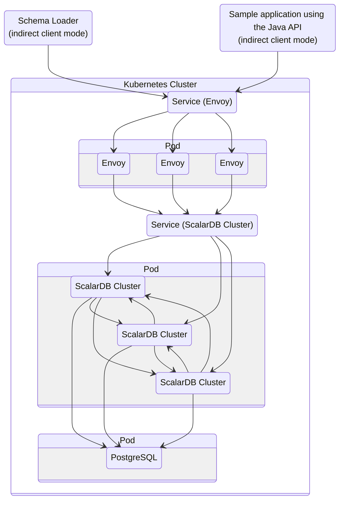

# Getting Started with ScalarDB Cluster

This tutorial describes how to create a sample application that uses [ScalarDB Cluster](./section-home.md) through the Java API.

## Overview

This tutorial illustrates the process of creating a sample e-commerce application, where items can be ordered and paid for with a line of credit by using ScalarDB.

:::note

Since the focus of the sample application is to demonstrate using ScalarDB, application-specific error handling, authentication processing, and similar functions are not included in the sample application. For details about exception handling in ScalarDB, see [Handle exceptions](../api-guide.md#how-to-handle-exceptions).

:::

The following diagram shows the system architecture of the sample application:



### What you can do in this sample application

The sample application supports the following types of transactions:

- Get customer information.
- Place an order by using a line of credit.
  - Checks if the cost of the order is below the customer's credit limit.
  - If the check passes, records the order history and updates the amount the customer has spent.
- Get order information by order ID.
- Get order information by customer ID.
- Make a payment.
  - Reduces the amount the customer has spent.

## Prerequisites for this sample application

- One of the following Java Development Kits (JDKs):

- **[Oracle JDK](https://www.oracle.com/java/):** 8, 11, 17, or 21 (LTS versions)
- **OpenJDK distribution ([Eclipse Temurin](https://adoptium.net/temurin/), [Amazon Corretto](https://aws.amazon.com/corretto/), or [Microsoft Build of OpenJDK](https://learn.microsoft.com/en-us/java/openjdk/)):** 8, 11, 17, or 21 (LTS versions)

- ScalarDB Cluster running on a Kubernetes cluster
  - We assume that you have a ScalarDB Cluster running on a Kubernetes cluster that you deployed by following the instructions in [Set Up ScalarDB Cluster on Kubernetes by Using a Helm Chart](./setup-scalardb-cluster-on-kubernetes-by-using-helm-chart.md).

## Set up ScalarDB Cluster

The following sections describe how to set up the sample e-commerce application.

### Clone the ScalarDB samples repository

Open **Terminal**, then clone the ScalarDB samples repository by running the following command:

```console
git clone https://github.com/scalar-labs/scalardb-samples
```

Then, go to the directory that contains the sample application by running the following command:

```console
cd scalardb-samples/scalardb-sample
```

### Modify `build.gradle`

To use ScalarDB Cluster, open `build.gradle` in your preferred text editor. Then, delete the existing dependency for `com.scalar-labs:scalardb` from the `dependencies` section, and add the following dependency to the `dependencies` section:

```gradle
dependencies {
    ...

    implementation 'com.scalar-labs:scalardb-cluster-java-client-sdk:3.18.1'
}
```

### Modify `database.properties`

You need to modify `database.properties` to connect to ScalarDB Cluster as well. But before doing so, you need to get the `EXTERNAL-IP` address of the Envoy service resource (`scalardb-cluster-envoy`). To get the service resource, run the following command:

```console
kubectl get svc scalardb-cluster-envoy
```

You should see a similar output as below, with different values for `CLUSTER-IP`, `PORT(S)`, and `AGE`:

```console
NAME                     TYPE           CLUSTER-IP      EXTERNAL-IP   PORT(S)           AGE
scalardb-cluster-envoy   LoadBalancer   10.105.121.51   localhost     60053:30641/TCP   16h
```

In this case, the `EXTERNAL-IP` address is `localhost`.

In `database.properties`, you need to specify `cluster` for the `scalar.db.transaction_manager` property and use `indirect` as the client mode for `scalar.db.contact_points` to connect to the Envoy service resource.

Open `database.properties` by running the following command:

```console
vim database.properties
```

Then, modify `database.properties` as follows:

```properties
scalar.db.transaction_manager=cluster
scalar.db.contact_points=indirect:localhost
```

:::note

For details about the client modes, see [Developer Guide for ScalarDB Cluster with the Java API](./developer-guide-for-scalardb-cluster-with-java-api.md).

:::

### Load the schema

The database schema (the method in which the data will be organized) for the sample application has already been defined in [`schema.json`](https://github.com/scalar-labs/scalardb-samples/tree/main/scalardb-sample/schema.json).

To apply the schema, go to [ScalarDB Releases](https://github.com/scalar-labs/scalardb/releases/tag/v3.18.1) and download the ScalarDB Cluster Schema Loader to the `scalardb-samples/scalardb-sample` folder.

Then, run the following command:

```console
java -jar scalardb-cluster-schema-loader-3.18.1-all.jar --config database.properties -f schema.json --coordinator
```

#### Schema details

As shown in [`schema.json`](https://github.com/scalar-labs/scalardb-samples/tree/main/scalardb-sample/schema.json) for the sample application, all the tables are created in the `sample` namespace.

- `sample.customers`: a table that manages customer information
  - `credit_limit`: the maximum amount of money that the lender will allow the customer to spend from their line of credit
  - `credit_total`: the amount of money that the customer has spent from their line of credit
- `sample.orders`: a table that manages order information
- `sample.statements`: a table that manages order statement information
- `sample.items`: a table that manages information for items to be ordered

The Entity Relationship Diagram for the schema is as follows:


### Load the initial data

Before running the sample application, you need to load the initial data by running the following command:

```console
./gradlew run --args="LoadInitialData"
```

After the initial data has loaded, the following records should be stored in the tables.

**`sample.customers` table**

| customer_id | name          | credit_limit | credit_total |
|-------------|---------------|--------------|--------------|
| 1           | Yamada Taro   | 10000        | 0            |
| 2           | Yamada Hanako | 10000        | 0            |
| 3           | Suzuki Ichiro | 10000        | 0            |

**`sample.items` table**

| item_id | name   | price |
|---------|--------|-------|
| 1       | Apple  | 1000  |
| 2       | Orange | 2000  |
| 3       | Grape  | 2500  |
| 4       | Mango  | 5000  |
| 5       | Melon  | 3000  |

## Execute transactions and retrieve data in the sample application

The following sections describe how to execute transactions and retrieve data in the sample e-commerce application.

### Get customer information

Start with getting information about the customer whose ID is `1` by running the following command:

```console
./gradlew run --args="GetCustomerInfo 1"
```

You should see the following output:

```console
...
{"id": 1, "name": "Yamada Taro", "credit_limit": 10000, "credit_total": 0}
...
```

### Place an order

Then, have customer ID `1` place an order for three apples and two oranges by running the following command:

:::note

The order format in this command is `./gradlew run --args="PlaceOrder <CUSTOMER_ID> <ITEM_ID>:<COUNT>,<ITEM_ID>:<COUNT>,..."`.

:::

```console
./gradlew run --args="PlaceOrder 1 1:3,2:2"
```

You should see a similar output as below, with a different UUID for `order_id`, which confirms that the order was successful:

```console
...
{"order_id": "dea4964a-ff50-4ecf-9201-027981a1566e"}
...
```

### Check the order details

Check details about the order by running the following command, replacing `<ORDER_ID_UUID>` with the UUID for the `order_id` that was shown after running the previous command:

```console
./gradlew run --args="GetOrder <ORDER_ID_UUID>"
```

You should see a similar output as below, with different UUIDs for `order_id` and `timestamp`:

```console
...
{"order": {"order_id": "dea4964a-ff50-4ecf-9201-027981a1566e","timestamp": 1650948340914,"customer_id": 1,"customer_name": "Yamada Taro","statement": [{"item_id": 1,"item_name": "Apple","price": 1000,"count": 3,"total": 3000},{"item_id": 2,"item_name": "Orange","price": 2000,"count": 2,"total": 4000}],"total": 7000}}
...
```

### Place another order

Place an order for one melon that uses the remaining amount in `credit_total` for customer ID `1` by running the following command:

```console
./gradlew run --args="PlaceOrder 1 5:1"
```

You should see a similar output as below, with a different UUID for `order_id`, which confirms that the order was successful:

```console
...
{"order_id": "bcc34150-91fa-4bea-83db-d2dbe6f0f30d"}
...
```

### Check the order history

Get the history of all orders for customer ID `1` by running the following command:

```console
./gradlew run --args="GetOrders 1"
```

You should see a similar output as below, with different UUIDs for `order_id` and `timestamp`, which shows the history of all orders for customer ID `1` in descending order by timestamp:

```console
...
{"order": [{"order_id": "dea4964a-ff50-4ecf-9201-027981a1566e","timestamp": 1650948340914,"customer_id": 1,"customer_name": "Yamada Taro","statement": [{"item_id": 1,"item_name": "Apple","price": 1000,"count": 3,"total": 3000},{"item_id": 2,"item_name": "Orange","price": 2000,"count": 2,"total": 4000}],"total": 7000},{"order_id": "bcc34150-91fa-4bea-83db-d2dbe6f0f30d","timestamp": 1650948412766,"customer_id": 1,"customer_name": "Yamada Taro","statement": [{"item_id": 5,"item_name": "Melon","price": 3000,"count": 1,"total": 3000}],"total": 3000}]}
...
```

### Check the credit total

Get the credit total for customer ID `1` by running the following command:

```console
./gradlew run --args="GetCustomerInfo 1"
```

You should see the following output, which shows that customer ID `1` has reached their `credit_limit` in `credit_total` and cannot place anymore orders:

```console
...
{"id": 1, "name": "Yamada Taro", "credit_limit": 10000, "credit_total": 10000}
...
```

Try to place an order for one grape and one mango by running the following command:

```console
./gradlew run --args="PlaceOrder 1 3:1,4:1"
```

You should see the following output, which shows that the order failed because the `credit_total` amount would exceed the `credit_limit` amount.

```console
...
java.lang.RuntimeException: Credit limit exceeded
        at sample.Sample.placeOrder(Sample.java:205)
        at sample.command.PlaceOrderCommand.call(PlaceOrderCommand.java:33)
        at sample.command.PlaceOrderCommand.call(PlaceOrderCommand.java:8)
        at picocli.CommandLine.executeUserObject(CommandLine.java:1783)
        at picocli.CommandLine.access$900(CommandLine.java:145)
        at picocli.CommandLine$RunLast.handle(CommandLine.java:2141)
        at picocli.CommandLine$RunLast.handle(CommandLine.java:2108)
        at picocli.CommandLine$AbstractParseResultHandler.execute(CommandLine.java:1975)
        at picocli.CommandLine.execute(CommandLine.java:1904)
        at sample.command.SampleCommand.main(SampleCommand.java:35)
...
```

### Make a payment

To continue making orders, customer ID `1` must make a payment to reduce the `credit_total` amount.

Make a payment by running the following command:

```console
./gradlew run --args="Repayment 1 8000"
```

Then, check the `credit_total` amount for customer ID `1` by running the following command:

```console
./gradlew run --args="GetCustomerInfo 1"
```

You should see the following output, which shows that a payment was applied to customer ID `1`, reducing the `credit_total` amount:

```console
...
{"id": 1, "name": "Yamada Taro", "credit_limit": 10000, "credit_total": 2000}
...
```

Now that customer ID `1` has made a payment, place an order for one grape and one mango by running the following command:

```console
./gradlew run --args="PlaceOrder 1 3:1,4:1"
```

You should see a similar output as below, with a different UUID for `order_id`, which confirms that the order was successful:

```console
...
{"order_id": "8911cab3-1c2b-4322-9386-adb1c024e078"}
...
```

## See also

For other ScalarDB Cluster tutorials, see the following:

- [Getting Started with ScalarDB Cluster GraphQL](./getting-started-with-scalardb-cluster-graphql.md)
- [Getting Started with ScalarDB Cluster SQL via JDBC](./getting-started-with-scalardb-cluster-sql-jdbc.md)
- [Getting Started with ScalarDB Cluster SQL via Spring Data JDBC for ScalarDB](./getting-started-with-scalardb-cluster-sql-spring-data-jdbc.md)
- [Getting Started with Using Go for ScalarDB Cluster](./getting-started-with-using-go-for-scalardb-cluster.md)
- [Getting Started with Using Python for ScalarDB Cluster](./getting-started-with-using-python-for-scalardb-cluster.md)

For details about developing applications that use ScalarDB Cluster with the Java API, refer to the following:

- [Developer Guide for ScalarDB Cluster with the Java API](./developer-guide-for-scalardb-cluster-with-java-api.md)

For details about the ScalarDB Cluster gRPC API, refer to the following:

- [ScalarDB Cluster gRPC API Guide](./scalardb-cluster-grpc-api-guide.md)
- [ScalarDB Cluster SQL gRPC API Guide](./scalardb-cluster-sql-grpc-api-guide.md)
