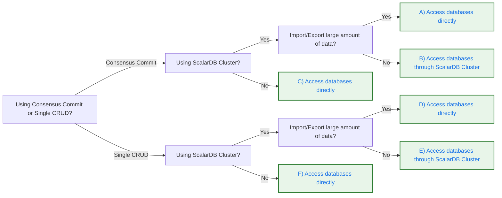

# ScalarDB Data Loader

ScalarDB Data Loader is a utility tool enabling you to import and export data with ScalarDB Core easily. If you're using ScalarDB Cluster, you can use ScalarDB Cluster Data Loader, which is a version of Data Loader that you can use to either access backend databases directly or connect to the cluster to perform import and export operations through it.

Data Loader provides structured import and export processes with validation, error handling, and detailed logging to help you safely move data in and out of ScalarDB.

## Choose the right configuration based on your use case

Use the following decision tree to determine which configuration pattern is appropriate for your use case:



:::note

When using Consensus Commit, if you want SERIALIZABLE isolation, stop the cluster. If you can accept READ COMMITTED isolation, you don't need to stop the cluster.

:::

### Configuration patterns {#configuration-patterns}

Based on the decision tree, select your configuration pattern:

**A/C: Access databases directly**

Use this pattern when you need Consensus Commit transactions and are accessing databases directly (either because you don't have ScalarDB Cluster, or you have large amounts of data to import/export). Rows are imported by using transactional operations, ensuring ACID properties. By default, up to 100 put operations are grouped into a single transaction. You can adjust this by using the `--transaction-size` option.

**Client configuration** (scalardb.properties for Data Loader):

```properties
# Transaction manager for direct database access with Consensus Commit
scalar.db.transaction_manager=consensus-commit

# Storage configuration (example for PostgreSQL)
scalar.db.storage=jdbc
scalar.db.contact_points=jdbc:postgresql://<DATABASE_HOST>:5432/<DATABASE_NAME>
scalar.db.username=<USERNAME>
scalar.db.password=<PASSWORD>
```

For other database configurations, see [ScalarDB Configurations](./configurations.md).

When running import commands, use `--mode TRANSACTION`. The `--mode` argument is not required for export commands.

:::note

When using the Consensus Commit transaction manager, each transaction group (100 records by default) meets ACID guarantees, but the overall import or export operation is not atomic. If interrupted, some groups may be committed while others are not. Use the log files to identify and retry failed records.

:::

:::warning

To ensure data consistency:
- **With ScalarDB Cluster (Pattern A):** Stop the cluster during the import or export operation.
- **Without ScalarDB Cluster (Pattern C):** Stop other processes that update the databases during the operation.

:::

**B: Access databases through ScalarDB Cluster**

Use this pattern when you have ScalarDB Cluster configured for Consensus Commit transactions and are not importing or exporting large amounts of data.

**Client configuration** (scalardb.properties for ScalarDB Cluster Data Loader):

```properties
# Transaction manager for connecting to ScalarDB Cluster
scalar.db.transaction_manager=cluster

# Contact point of the cluster (use your load balancer address)
scalar.db.contact_points=indirect:<SCALARDB_CLUSTER_HOST>

# Optional: Port number (default is 60053)
scalar.db.contact_port=60053
```

Replace `<SCALARDB_CLUSTER_HOST>` with your ScalarDB Cluster endpoint (for example, `localhost` or `192.168.10.1`).

**Cluster configuration** (scalardb-cluster-node.properties):

```properties
# Transaction manager on the cluster side
scalar.db.transaction_manager=consensus-commit

# Isolation level (SNAPSHOT, SERIALIZABLE, or READ_COMMITTED)
scalar.db.consensus_commit.isolation_level=SNAPSHOT

# Storage configuration (example for PostgreSQL)
scalar.db.storage=jdbc
scalar.db.contact_points=jdbc:postgresql://<DATABASE_HOST>:5432/<DATABASE_NAME>
scalar.db.username=<USERNAME>
scalar.db.password=<PASSWORD>
```

For other database configurations, see [ScalarDB Cluster Configurations](./scalardb-cluster/scalardb-cluster-configurations.md).

When running import commands, use `--mode TRANSACTION`. The `--mode` argument is not required for export commands.

:::warning

To ensure data consistency, stop other processes that update the databases through ScalarDB Cluster during the import or export operation.

:::

**D/F: Access databases directly**

Use this pattern when you need non-transactional storage operations and are accessing databases directly (either because you don't have ScalarDB Cluster, or you have large amounts of data to import/export).

**Client configuration** (scalardb.properties for Data Loader):

```properties
# Transaction manager for direct database access (non-transactional)
scalar.db.transaction_manager=single-crud-operation

# Storage configuration (example for PostgreSQL)
scalar.db.storage=jdbc
scalar.db.contact_points=jdbc:postgresql://<DATABASE_HOST>:5432/<DATABASE_NAME>
scalar.db.username=<USERNAME>
scalar.db.password=<PASSWORD>
```

For other database configurations, see [ScalarDB Configurations](./configurations.md).

When running import commands, use `--mode STORAGE`. The `--mode` argument is not required for export commands.

**E: Access databases through ScalarDB Cluster**

Use this pattern when you have ScalarDB Cluster configured for non-transactional storage operations and are not importing or exporting large amounts of data.

**Client configuration** (scalardb.properties for ScalarDB Cluster Data Loader):

```properties
# Transaction manager for connecting to ScalarDB Cluster
scalar.db.transaction_manager=cluster

# Contact point of the cluster (use your load balancer address)
scalar.db.contact_points=indirect:<SCALARDB_CLUSTER_HOST>

# Optional: Port number (default is 60053)
scalar.db.contact_port=60053
```

Replace `<SCALARDB_CLUSTER_HOST>` with your ScalarDB Cluster endpoint (for example, `localhost` or `192.168.10.1`).

**Cluster configuration** (scalardb-cluster-node.properties):

```properties
# Transaction manager on the cluster side (non-transactional)
scalar.db.transaction_manager=single-crud-operation

# Storage configuration (example for PostgreSQL)
scalar.db.storage=jdbc
scalar.db.contact_points=jdbc:postgresql://<DATABASE_HOST>:5432/<DATABASE_NAME>
scalar.db.username=<USERNAME>
scalar.db.password=<PASSWORD>
```

For other database configurations, see [ScalarDB Cluster Configurations](./scalardb-cluster/scalardb-cluster-configurations.md).

When running import commands, use `--mode STORAGE`. The `--mode` argument is not required for export commands.

## Prerequisites

**ScalarDB Cluster**

Before using Data Loader with ScalarDB Cluster, make sure you have the following:

- One of the following Java Development Kits (JDKs):

- **[Oracle JDK](https://www.oracle.com/java/):** 8, 11, 17, or 21 (LTS versions)
- **OpenJDK distribution ([Eclipse Temurin](https://adoptium.net/temurin/), [Amazon Corretto](https://aws.amazon.com/corretto/), or [Microsoft Build of OpenJDK](https://learn.microsoft.com/en-us/java/openjdk/)):** 8, 11, 17, or 21 (LTS versions)

- A valid **`scalardb.properties`** file configured with ScalarDB Cluster connection settings (cluster endpoint and port)
- A running ScalarDB Cluster instance and network access to cluster endpoints

**Direct database access**

Before using Data Loader with direct database access, make sure you have the following:

- One of the following Java Development Kits (JDKs):

- **[Oracle JDK](https://www.oracle.com/java/):** 8, 11, 17, or 21 (LTS versions)
- **OpenJDK distribution ([Eclipse Temurin](https://adoptium.net/temurin/), [Amazon Corretto](https://aws.amazon.com/corretto/), or [Microsoft Build of OpenJDK](https://learn.microsoft.com/en-us/java/openjdk/)):** 8, 11, 17, or 21 (LTS versions)

- A valid **`scalardb.properties`** file configured with direct database connection settings
- Database permissions for read and write operations (see [Database permission requirements](./requirements.md#database-permission-requirements))

## Set up Data Loader

**ScalarDB Cluster**

Select your preferred method to set up Data Loader, and follow the instructions.

**Fat JAR**

Download **`scalardb-cluster-data-loader-<VERSION>-all.jar`** from the [ScalarDB Releases](https://github.com/scalar-labs/scalardb/releases) page.

Verify the installation by running the following command, replacing `<VERSION>` with the version number:

```console
java -jar scalardb-cluster-data-loader-<VERSION>-all.jar --help
```

If successful, you'll see the list of available commands and options.

**Docker container**

You can pull the Docker image from the [Scalar container registry](https://github.com/orgs/scalar-labs/packages/container/package/scalardb-cluster-data-loader-cli) by running the following command, replacing the contents in the angle brackets as described:

```console
docker pull ghcr.io/scalar-labs/scalardb-cluster-data-loader-cli:<VERSION>
```

You can run Data Loader commands by using the container. The following example shows how to verify the installation:

```console
docker run --rm ghcr.io/scalar-labs/scalardb-cluster-data-loader-cli:<VERSION> --help
```

If successful, you'll see the list of available commands and options.

:::note

All command examples in this documentation use the JAR file syntax. You can run the same commands with the container by replacing `java -jar scalardb-cluster-data-loader-<VERSION>-all.jar` with the Docker equivalent and mounting your local files as volumes. For example:

```console
# JAR syntax
java -jar scalardb-cluster-data-loader-<VERSION>-all.jar import \
  --config scalardb.properties --file data.json ...

# Docker equivalent
docker run --rm \
  -v ./scalardb.properties:/scalardb.properties \
  -v ./data.json:/data.json \
  ghcr.io/scalar-labs/scalardb-cluster-data-loader-cli:<VERSION> \
  import --config /scalardb.properties --file /data.json ...
```

:::

**Direct database access**

Select your preferred method to set up Data Loader, and follow the instructions.

**Fat JAR**

Download **`scalardb-data-loader-<VERSION>.jar`** from the [ScalarDB Releases](https://github.com/scalar-labs/scalardb/releases) page.

Verify the installation by running the following command, replacing `<VERSION>` with the version number:

```console
java -jar scalardb-data-loader-<VERSION>.jar --help
```

If successful, you'll see the list of available commands and options.

**Docker container**

You can pull the Docker image from the [Scalar container registry](https://github.com/orgs/scalar-labs/packages/container/package/scalardb-data-loader-cli) by running the following command, replacing the contents in the angle brackets as described:

```console
docker pull ghcr.io/scalar-labs/scalardb-data-loader-cli:<VERSION>
```

You can run Data Loader commands by using the container. The following example shows how to verify the installation:

```console
docker run --rm ghcr.io/scalar-labs/scalardb-data-loader-cli:<VERSION> --help
```

If successful, you'll see the list of available commands and options.

:::note

All command examples in this documentation use the JAR file syntax. You can run the same commands with the container by replacing `java -jar scalardb-data-loader-<VERSION>.jar` with the Docker equivalent and mounting your local files as volumes. For example:

```console
# JAR syntax
java -jar scalardb-data-loader-<VERSION>.jar import \
  --config scalardb.properties --file data.json ...

# Docker equivalent
docker run --rm \
  -v ./scalardb.properties:/scalardb.properties \
  -v ./data.json:/data.json \
  ghcr.io/scalar-labs/scalardb-data-loader-cli:<VERSION> \
  import --config /scalardb.properties --file /data.json ...
```

:::

## Importing data

This section explains how to use the import function in Data Loader.

### Basic import example

The simplest way to import data is with automatic field mapping, where Data Loader matches source file fields to table columns by name.

Data Loader supports three file formats: JSON, JSONL (JSON Lines), and CSV. The following examples show how to import each format.

**JSON**

**Import a JSON file with automatic mapping**

To import a JSON file into your table, run the following command, replacing the contents of the angle brackets as described:

**ScalarDB Cluster**

```console
java -jar scalardb-cluster-data-loader-<VERSION>-all.jar import \
  --config scalardb.properties \
  --mode TRANSACTION \
  --namespace <NAMESPACE_NAME> \
  --table <TABLE_NAME> \
  --file <FILE_PATH>.json \
  --format JSON
```

**Direct database access**

```console
java -jar scalardb-data-loader-<VERSION>.jar import \
  --config scalardb.properties \
  --mode TRANSACTION \
  --namespace <NAMESPACE_NAME> \
  --table <TABLE_NAME> \
  --file <FILE_PATH>.json \
  --format JSON
```

This command imports the JSON file into the specified table using default settings (INSERT mode, automatic field mapping).

**Example JSON file format:**

```json
[
  {
    "id": 1,
    "name": "Product A",
    "price": 100
  },
  {
    "id": 2,
    "name": "Product B",
    "price": 200
  }
]
```

**JSONL**

**Import a JSONL (JSON Lines) file with automatic mapping**

To import a JSONL file into your table, run the following command, replacing the contents of the angle brackets as described:

**ScalarDB Cluster**

```console
java -jar scalardb-cluster-data-loader-<VERSION>-all.jar import \
  --config scalardb.properties \
  --mode TRANSACTION \
  --namespace <NAMESPACE_NAME> \
  --table <TABLE_NAME> \
  --file <FILE_PATH>.jsonl \
  --format JSONL
```

**Direct database access**

```console
java -jar scalardb-data-loader-<VERSION>.jar import \
  --config scalardb.properties \
  --mode TRANSACTION \
  --namespace <NAMESPACE_NAME> \
  --table <TABLE_NAME> \
  --file <FILE_PATH>.jsonl \
  --format JSONL
```

This command imports the JSONL file into the specified table using default settings (INSERT mode, automatic field mapping).

**Example JSONL file format:**

```json
{"id": 1, "name": "Product A", "price": 100}
{"id": 2, "name": "Product B", "price": 200}
```

**CSV**

**Import a CSV file with automatic mapping**

To import a CSV file into your table, run the following command, replacing the contents of the angle brackets as described:

**ScalarDB Cluster**

```console
java -jar scalardb-cluster-data-loader-<VERSION>-all.jar import \
  --config scalardb.properties \
  --mode TRANSACTION \
  --namespace <NAMESPACE_NAME> \
  --table <TABLE_NAME> \
  --file <FILE_PATH>.csv \
  --format CSV
```

**Direct database access**

```console
java -jar scalardb-data-loader-<VERSION>.jar import \
  --config scalardb.properties \
  --mode TRANSACTION \
  --namespace <NAMESPACE_NAME> \
  --table <TABLE_NAME> \
  --file <FILE_PATH>.csv \
  --format CSV
```

This command imports the CSV file into the specified table using default settings (INSERT mode, automatic field mapping).

**Example CSV file format:**

```csv
id,name,price
1,Product A,100
2,Product B,200
```

:::note

The CSV file must include a header row with column names that match your table columns. If your CSV file doesn't have a header row, use the `--header` flag to specify column names.

:::

:::warning

When importing data by using direct database access, keep the following in mind to ensure data consistency:

- **With ScalarDB Cluster in your environment:** Stop the cluster during the operation.
- **Without ScalarDB Cluster:** Stop other processes that update the databases during the operation.

:::

### Common import scenarios

This section describes common import scenarios.

#### Update existing records instead of inserting new ones

To update existing records instead of inserting new ones, run the following command, replacing the contents of the angle brackets as described:

**ScalarDB Cluster**

```console
java -jar scalardb-cluster-data-loader-<VERSION>-all.jar import \
  --config scalardb.properties \
  --mode TRANSACTION \
  --namespace <NAMESPACE_NAME> \
  --table <TABLE_NAME> \
  --file <FILE_PATH>.json \
  --format JSON \
  --import-mode UPDATE
```

**Direct database access**

```console
java -jar scalardb-data-loader-<VERSION>.jar import \
  --config scalardb.properties \
  --mode TRANSACTION \
  --namespace <NAMESPACE_NAME> \
  --table <TABLE_NAME> \
  --file <FILE_PATH>.json \
  --format JSON \
  --import-mode UPDATE
```

#### Import with custom field mapping using a control file

If your source file fields don't match your table column names, you can use a control file to define custom mapping rules. For details on creating control files and mapping configurations, see [Custom data mapping](#custom-data-mapping).

To import with custom field mapping using a control file, run the following command, replacing the contents of the angle brackets as described:

**ScalarDB Cluster**

```console
java -jar scalardb-cluster-data-loader-<VERSION>-all.jar import \
  --config scalardb.properties \
  --mode TRANSACTION \
  --file <FILE_PATH>.json \
  --format JSON \
  --control-file <CONTROL_FILE>.json
```

**Direct database access**

```console
java -jar scalardb-data-loader-<VERSION>.jar import \
  --config scalardb.properties \
  --mode TRANSACTION \
  --file <FILE_PATH>.json \
  --format JSON \
  --control-file <CONTROL_FILE>.json
```

#### Import CSV data with a custom delimiter

To import CSV data with a custom delimiter, run the following command, replacing the contents of the angle brackets as described:

**ScalarDB Cluster**

```console
java -jar scalardb-cluster-data-loader-<VERSION>-all.jar import \
  --config scalardb.properties \
  --mode TRANSACTION \
  --namespace <NAMESPACE_NAME> \
  --table <TABLE_NAME> \
  --file <FILE_PATH>.csv \
  --format CSV \
  --delimiter ";"
```

**Direct database access**

```console
java -jar scalardb-data-loader-<VERSION>.jar import \
  --config scalardb.properties \
  --mode TRANSACTION \
  --namespace <NAMESPACE_NAME> \
  --table <TABLE_NAME> \
  --file <FILE_PATH>.csv \
  --format CSV \
  --delimiter ";"
```

### Configuring your import

For more control over the import process, you can configure various options:

#### Import modes

Choose the appropriate import mode based on your use case:

- **INSERT** (default): Insert new records only. Fails if data already exists based on partition and clustering keys.
- **UPDATE**: Update existing records only. Fails if data doesn't exist.
- **UPSERT**: Insert new records or update existing ones based on partition and clustering keys.

:::note

When using INSERT mode, you must have matching fields in the source file for each target column (via automatic or custom data mapping). This requirement also applies when an UPSERT operation results in an INSERT operation.

:::

### Command-line flags

The following is a list of flags (options) that can be used with the import function in Data Loader:

| Flag                         | Description                                                  | Usage                                                       |
| ---------------------------- | ------------------------------------------------------------ | ----------------------------------------------------------- |
| `--mode`                       | The access mode for Data Loader. Required. Supported modes are `STORAGE` (single CRUD) and `TRANSACTION` (Consensus Commit). When using ScalarDB Cluster, the mode must match the `scalar.db.transaction_manager` setting in the Cluster configuration. When accessing databases directly, the mode must match the `scalar.db.transaction_manager` setting. | `scalardb-data-loader --mode TRANSACTION`                   |
| `--config`                     | The path to the `.properties` file for ScalarDB. This file should contain either cluster connection settings or direct database connection settings, depending on your chosen access pattern. If omitted, the tool looks for a file named `scalardb.properties` in the current folder. | `scalardb-data-loader --config scalardb.properties`         |
| `--namespace`                  | The namespace to import table data to. Required when no control file is provided. | `scalardb-data-loader --namespace namespace`                |
| `--table`                      | The name of the table to import data to. Required when no control file is provided. | `scalardb-data-loader --table tableName`                    |
| `--import-mode`                | Mode to import data into the ScalarDB table. Supported modes are `INSERT`, `UPDATE`, and `UPSERT`. Optional. The default value is `INSERT`. | `scalardb-data-loader --import-mode UPDATE`                 |
| `--require-all-columns`        | If set, data rows cannot be imported if they are missing columns. Optional. The default value is `false`. | `scalardb-data-loader --require-all-columns`                |
| `--file`                       | The path to the file that will be imported. Required. | `scalardb-data-loader --file <PATH_TO_FILE>`                |
| `--log-dir`                    | Directory where log files should be stored. Optional. The default value is `logs`. | `scalardb-data-loader --log-dir <PATH_TO_DIR>`              |
| `--log-success`                | Enable logging of successfully processed records. Optional. The default value is `false`. | `scalardb-data-loader --log-success`                        |
| `--log-raw-record`             | Include the original source record in the log file output. Optional. The default value is `false`. | `scalardb-data-loader --log-raw-record`                     |
| `--max-threads`                | Maximum number of threads to use for parallel processing. The default value is the number of available processors. | `scalardb-data-loader --max-threads 10`                     |
| `--format`                     | The format of the import file. Supported formats are `JSON`, `JSONL`, and `CSV`. Optional. The default value is `JSON`. | `scalardb-data-loader --format CSV`                         |
| `--ignore-nulls`               | Ignore null values in the source file during import. This means that existing data will not be overwritten by null values. Optional. The default value is `false`. | `scalardb-data-loader --ignore-nulls`                       |
| `--pretty-print`               | **(JSON/JSONL only)** Enable pretty printing for JSON output in log files. Optional. The default value is `false`. | `scalardb-data-loader --pretty-print`                       |
| `--control-file`               | The path to the JSON control file that specifies the rules for custom data mapping and/or multi-table import. | `scalardb-data-loader --control-file control.json`          |
| `--control-file-validation`    | The validation level for the control file. Supported levels are `MAPPED`, `KEYS`, and `FULL`. Optional. The default level is `MAPPED`. | `scalardb-data-loader --control-file-validation FULL`       |
| `--delimiter`                  | **(CSV only)** Delimiter character used in the CSV import file. The default delimiter is a comma. | `scalardb-data-loader --delimiter ";"`                      |
| `--header`                     | **(CSV only)** Specify the header row when the import file contains CSV data and does not have a header row. Provide the column names as a single, delimiter-separated list. If you change `--delimiter`, use the same delimiter in the header value. | `scalardb-data-loader --header id,name,price`               |
| `--data-chunk-size`            | Number of records to load into memory for processing before moving to the next batch. This controls memory usage, not transaction boundaries. Optional. The default value is `500`. | `scalardb-data-loader --data-chunk-size 1000`               |
| `--data-chunk-queue-size`      | Maximum queue size for loaded records waiting to be processed. Optional. The default value is `256`. | `scalardb-data-loader --data-chunk-queue-size 100`          |
| `--split-log-mode`             | Split log file into multiple files based on data chunks. Optional. The default value is `false`. | `scalardb-data-loader --split-log-mode`                     |
| `--transaction-size`           | Group size of put operations per transaction commit. Specifies how many records are committed together in a single transaction. Only supported when using Consensus Commit. Optional. The default value is `100`. | `scalardb-data-loader --transaction-size 200`               |

### Data mapping

This section explains the two data-mapping types: automatic data mapping and custom data mapping.

#### Automatic data mapping

If no control file is provided, Data Loader will automatically map the fields in the source data to the available columns in the ScalarDB table. If the name doesn't match, and if all columns are required, a validation error will occur. If that occurs, importing the record will fail and the result will be added to the failed output log.

#### Custom data mapping

If the source fields don't match the target column name, you must use a control file. In the control file, you will need to specify the custom mapping rules for the field names.

For example, the following control file maps the field `source_field_name` in the source file to `target_column_name` in the target table:

```json
{
	"tables": [{
			"namespace": "<NAMESPACE>",
			"table_name": "<TABLE>",
			"mappings": [{
				"source_field": "<SOURCE_FIELD_NAME>",
				"target_column": "<TARGET_COLUMN_NAME>"
			}]
		}
	]
}
```

### Control file

To allow for custom data mapping or multi-table importing, Data Loader supports configuration via a JSON control file. This file needs to be passed in via the `--control-file` argument when starting Data Loader.

#### Control file validation levels

To enforce validation on the control file, Data Loader allows you to specify the validation level. Based on the set level, Data Loader will run a pre-check and validate the control file based on the level rules.

The following levels are supported:

| Level | What It Validates | When to Use |
| ----- | ----------------- | ----------- |
| FULL | All table columns have mappings | Ensuring your control file covers every column |
| KEYS | Only partition and clustering keys have mappings | Partial updates where you only care about key columns |
| MAPPED (default) | Only the mappings you specify are valid | You trust your control file and want minimal validation |

The validation level is optional and can be set via the `--control-file-validation` argument when starting Data Loader.

:::note

This validation is run as a pre-check and doesn't mean that the import process will automatically succeed.

For example, if the level is set to MAPPED and the control file doesn't contain mappings for each column for an INSERT operation, the import process will still fail because all columns are required to be mapped for an INSERT operation.

:::

### Multi-table import

Data Loader supports multi-table target importing, allowing you to import a single row from a JSON, JSON Lines, or CSV file into multiple tables by specifying table-mapping rules in the control file.

:::note

Multi-table import requires a control file. This feature is not supported without a control file.

:::

When using multi-table import in ScalarDB `TRANSACTION` mode, a separate transaction is created for each table that a source row is imported into. For example, if a source row is mapped to two tables in the control file, two separate transactions will be created.

**Example: Import one source row into multiple tables**

A JSON source record with multiple fields:

```json
[{
	"field1": "value1",
	"field2": "value2",
	"field3": "value3"
}]
```

Can be imported into multiple tables by using a control file that maps different fields to different tables:

```json
{
	"tables": [{
			"namespace": "<NAMESPACE>",
			"table_name": "<TABLE1>",
			"mappings": [{
				"source_field": "field1",
				"target_column": "<COLUMN1>"
			}, {
				"source_field": "field2",
				"target_column": "<COLUMN2>"
			}]
		},
		{
			"namespace": "<NAMESPACE>",
			"table_name": "<TABLE2>",
			"mappings": [{
				"source_field": "field1",
				"target_column": "<COLUMN1>"
			}, {
				"source_field": "field3",
				"target_column": "<COLUMN3>"
			}]
		}
	]
}
```

This configuration imports `field1` and `field2` into `<TABLE1>`, and `field1` and `field3` into `<TABLE2>`.

### Output logs

Data Loader creates detailed log files for every import operation, tracking both successful and failed records.

#### Log file locations

By default, Data Loader generates two log files in the `logs/` directory:

- **Success log:** Contains all successfully imported records.
- **Failure log:** Contains records that failed to import with error details.

You can change the log directory using the `--log-dir` flag.

#### Understanding the logs

Both log files include a `data_loader_import_status` field added to each record:

**In the success log:**

- Shows whether each record was inserted (new) or updated (existing).
- Includes transaction details when running in `TRANSACTION` mode.

**In the failure log:**

- Explains why each record failed to import.
- Lists specific validation errors or constraint violations.

#### Retrying failed imports

The failure log is designed for easy recovery:

1. **Edit the failed records** in the failure log to fix the issues (for example, adding missing columns and correcting invalid values).
2. **Use the edited file directly** as input for a new import operation.
3. **No cleanup needed** since the `data_loader_import_status` field is automatically ignored during re-import.

:::tip

Enable `--log-success` to log successfully imported records, and use `--log-raw-record` to include the original source data in the log output.

:::

#### Log format

| Field          | Description                                                  |
| -------------- | ------------------------------------------------------------ |
| `action`         | The result of the import process for the data record: UPDATE, INSERT, or FAILED_DURING_VALIDATION. |
| `namespace`      | The name of the namespace of the table that the data is imported into. |
| `tableName`      | The name of the table that the data is imported into.           |
| `is_data_mapped` | Whether custom data mapping was applied or not based on an available control file. |
| `tx_id`          | The transaction ID. Only available if Data Loader is run in `TRANSACTION` mode. |
| `value`          | The final value, after optional data mapping, that Data Loader uses in the `PUT` operation. |
| `row_number`     | The line number or record number of the source data.         |
| `errors`         | A list of validation or other errors for operations that failed during the import process. |

The following is an example of a JSON-formatted log file that shows a successful import:

```json
[{
	"column_1": 1,
	"column_2": 2,
	"column_n": 3,
	"data_loader_import_status": {
		"results": [{
		  "action": "UPDATE",
			"namespace": "namespace1",
			"tableName": "table1",
			"is_data_mapped": true,
			"tx_id": "value",
			"value": "value",
			"row_number": "value"
		}]
	}
}]
```
The following shows an example of a JSON-formatted log file of a failed import:

```json
[{
	"column_1": 1,
	"column_2": 2,
	"column_n": 3,
	"data_loader_import_status": {
		"results": [{
		  "action": "FAILED_DURING_VALIDATION",
			"namespace": "namespace1",
			"tableName": "table1",
			"is_data_mapped": false,
			"value": "value",
			"row_number": "value",
			"errors": [
			   "missing columns found during validation"
			]
		}]
	}
}]
```

### Duplicate data

:::warning

Make sure your import file doesn't contain duplicate records with the same partition keys and/or clustering keys. Data Loader does not detect or prevent duplicates in the source file.

:::

In ScalarDB `TRANSACTION` mode, attempting to update the same target data in fast succession will result in `No Mutation` errors. Data Loader does not handle these errors automatically. Failed data rows will be logged to the failed import result output file, where you can review and re-import them later if needed.

## Exporting data

This section explains how to use the export function in Data Loader.

:::note

Export operations use the same access patterns and configuration as imports. See the [Configuration patterns](#configuration-patterns) section for details on configuring Data Loader for ScalarDB Cluster access or direct database access.

:::

### Basic export example

The simplest way to export data is to export an entire table. Data Loader performs a ScalarDB scan operation and exports the results to a file.

Data Loader supports three export formats: JSON, JSONL (JSON Lines), and CSV. The following examples show how to export to each format.

**JSON**

**Export an entire table to JSON**

To export a table to JSON format, run the following command, replacing the contents of the angle brackets as described:

**ScalarDB Cluster**

```console
java -jar scalardb-cluster-data-loader-<VERSION>-all.jar export \
  --config scalardb.properties \
  --namespace <NAMESPACE_NAME> \
  --table <TABLE_NAME> \
  --format JSON
```

**Direct database access**

```console
java -jar scalardb-data-loader-<VERSION>.jar export \
  --config scalardb.properties \
  --namespace <NAMESPACE_NAME> \
  --table <TABLE_NAME> \
  --format JSON
```

This command exports all data from the specified table to a JSON file in the current directory. The output file will be automatically named by using the format `export.<namespace>.<table>.<timestamp>.json`.

**Example JSON output format:**

```json
[
  {
    "id": 1,
    "name": "Product A",
    "price": 100
  },
  {
    "id": 2,
    "name": "Product B",
    "price": 200
  }
]
```

**JSONL**

**Export an entire table to JSONL**

To export a table to JSONL (JSON Lines) format, run the following command, replacing the contents of the angle brackets as described:

**ScalarDB Cluster**

```console
java -jar scalardb-cluster-data-loader-<VERSION>-all.jar export \
  --config scalardb.properties \
  --namespace <NAMESPACE_NAME> \
  --table <TABLE_NAME> \
  --format JSONL
```

**Direct database access**

```console
java -jar scalardb-data-loader-<VERSION>.jar export \
  --config scalardb.properties \
  --namespace <NAMESPACE_NAME> \
  --table <TABLE_NAME> \
  --format JSONL
```

This command exports all data from the specified table to a JSONL file in the current directory. The output file will be automatically named by using the format `export.<namespace>.<table>.<timestamp>.jsonl`.

**Example JSONL output format:**

```json
{"id": 1, "name": "Product A", "price": 100}
{"id": 2, "name": "Product B", "price": 200}
```

**CSV**

**Export an entire table to CSV**

To export a table to CSV format, run the following command, replacing the contents of the angle brackets as described:

**ScalarDB Cluster**

```console
java -jar scalardb-cluster-data-loader-<VERSION>-all.jar export \
  --config scalardb.properties \
  --namespace <NAMESPACE_NAME> \
  --table <TABLE_NAME> \
  --format CSV
```

**Direct database access**

```console
java -jar scalardb-data-loader-<VERSION>.jar export \
  --config scalardb.properties \
  --namespace <NAMESPACE_NAME> \
  --table <TABLE_NAME> \
  --format CSV
```

This command exports all data from the specified table to a CSV file in the current directory. The output file will be automatically named by using the format `export.<namespace>.<table>.<timestamp>.csv`.

**Example CSV output format:**

```csv
id,name,price
1,Product A,100
2,Product B,200
```

:::note

By default, CSV exports include a header row with column names. Use the `--no-header` flag to exclude the header row if needed.

:::

:::warning

When exporting data by using direct database access, keep the following in mind to ensure data consistency:

- **With ScalarDB Cluster in your environment:** Stop the cluster during the operation.
- **Without ScalarDB Cluster:** Stop other processes that update the databases during the operation.

:::

:::warning[For full table exports only]

To export an entire table without specifying a partition key (full table scan), you must enable cross-partition scanning:

- **With ScalarDB Cluster:** Enable cross-partition scanning in your ScalarDB Cluster configuration.
- **Without ScalarDB Cluster (direct database access):** Enable cross-partition scanning in your `scalardb.properties` file:

```properties
scalar.db.cross_partition_scan.enabled=true
```

If this setting is not enabled, full table exports will fail. For details about this configuration, see [Cross-partition scan configurations](./configurations.md#cross-partition-scan-configurations).

When exporting a specific partition by using `--partition-key`, cross-partition scanning is not needed.

:::

### Common export scenarios

The following are some common data-exporting scenarios.

#### Export data to a specific file and format

To export data to a specific file and format, run the following command, replacing the contents of the angle brackets as described:

**ScalarDB Cluster**

```console
java -jar scalardb-cluster-data-loader-<VERSION>-all.jar export \
  --config scalardb.properties \
  --namespace <NAMESPACE_NAME> \
  --table <TABLE_NAME> \
  --output-file <OUTPUT_FILE_PATH>.csv \
  --format CSV
```

**Direct database access**

```console
java -jar scalardb-data-loader-<VERSION>.jar export \
  --config scalardb.properties \
  --namespace <NAMESPACE_NAME> \
  --table <TABLE_NAME> \
  --output-file <OUTPUT_FILE_PATH>.csv \
  --format CSV
```

#### Export specific columns only

To export specific columns only, run the following command, replacing the contents of the angle brackets as described:

**ScalarDB Cluster**

```console
java -jar scalardb-cluster-data-loader-<VERSION>-all.jar export \
  --config scalardb.properties \
  --namespace <NAMESPACE_NAME> \
  --table <TABLE_NAME> \
  --projection <COLUMN1>,<COLUMN2>,<COLUMN3>
```

**Direct database access**

```console
java -jar scalardb-data-loader-<VERSION>.jar export \
  --config scalardb.properties \
  --namespace <NAMESPACE_NAME> \
  --table <TABLE_NAME> \
  --projection <COLUMN1>,<COLUMN2>,<COLUMN3>
```

#### Export data for a specific partition key

To export data for a specific partition key, run the following command, replacing the contents of the angle brackets as described:

**ScalarDB Cluster**

```console
java -jar scalardb-cluster-data-loader-<VERSION>-all.jar export \
  --config scalardb.properties \
  --namespace <NAMESPACE_NAME> \
  --table <TABLE_NAME> \
  --partition-key <KEY_NAME>=<VALUE>
```

**Direct database access**

```console
java -jar scalardb-data-loader-<VERSION>.jar export \
  --config scalardb.properties \
  --namespace <NAMESPACE_NAME> \
  --table <TABLE_NAME> \
  --partition-key <KEY_NAME>=<VALUE>
```

#### Export with a row limit

To export with a row limit, run the following command, replacing the contents of the angle brackets as described:

**ScalarDB Cluster**

```console
java -jar scalardb-cluster-data-loader-<VERSION>-all.jar export \
  --config scalardb.properties \
  --namespace <NAMESPACE_NAME> \
  --table <TABLE_NAME> \
  --limit 1000
```

**Direct database access**

```console
java -jar scalardb-data-loader-<VERSION>.jar export \
  --config scalardb.properties \
  --namespace <NAMESPACE_NAME> \
  --table <TABLE_NAME> \
  --limit 1000
```

### Command-line flags

The following is a list of flags (options) that can be used with the export function in Data Loader:

| Flag                     | Description                                                  | Usage                                                  |
| ------------------------ | ------------------------------------------------------------ | ------------------------------------------------------ |
| `--config`                 | The path to the `.properties` file for ScalarDB. This file should contain either cluster connection settings or direct database connection settings, depending on your chosen access pattern. If omitted, the tool looks for a file named `scalardb.properties` in the current folder. | `scalardb-data-loader --config scalardb.properties`    |
| `--namespace`              | The namespace to export table data from. Required.               | `scalardb-data-loader --namespace namespace`           |
| `--table`                  | The name of the table to export data from. Required.                 | `scalardb-data-loader --table tableName`               |
| `--partition-key`          | A specific partition key to export data from. Specify in the format `key=value`. By default, this option exports all data from the specified table. | `scalardb-data-loader --partition-key id=100`          |
| `--sort-by`                | Clustering key sorting order. Supported values are `asc` and `desc`. This flag is only applicable when using `--partition-key`. | `scalardb-data-loader --sort-by asc`                   |
| `--projection`             | Columns to include in the export. Provide as a comma-separated list. You can also repeat the argument to provide multiple projections. | `scalardb-data-loader --projection column1,column2`    |
| `--start-key`              | Clustering key and value to mark the start of the scan. Specify in the format `key=value`. This flag is only applicable when using `--partition-key`. | `scalardb-data-loader --start-key timestamp=1000`      |
| `--start-inclusive`        | Make the start key inclusive. The default value is `true`. This flag is only applicable when using `--partition-key`. | `scalardb-data-loader --start-inclusive false`         |
| `--end-key`                | Clustering key and value to mark the end of the scan. Specify in the format `key=value`. This flag is only applicable when using `--partition-key`. | `scalardb-data-loader --end-key timestamp=9999`        |
| `--end-inclusive`          | Make the end key inclusive. The default value is `true`. This flag is only applicable when using `--partition-key`. | `scalardb-data-loader --end-inclusive false`           |
| `--limit`                  | Maximum number of rows to export. If omitted, there is no limit. | `scalardb-data-loader --limit 1000`                    |
| `--output-dir`             | Directory where the exported file should be saved. The default is the current directory.

Note: Data Loader doesn't create the output directory for you, so the directory needs to already exist. | `scalardb-data-loader --output-dir ./exports`          |
| `--output-file`            | The name of the output file for the exported data. If omitted, the tool will save the file with the following name format:
`export.<namespace>.<table>.<timestamp>.<format>` | `scalardb-data-loader --output-file output.json`       |
| `--format`                 | Format of the exported data file. Supported formats are `JSON`, `JSONL`, and `CSV`. The default value is `JSON`. | `scalardb-data-loader --format CSV`                    |
| `--delimiter`              | **(CSV only)** Delimiter character for CSV files. The default delimiter is a comma. | `scalardb-data-loader --delimiter ";"`                 |
| `--no-header`              | **(CSV only)** Exclude header row in CSV files. The default value is `false`. | `scalardb-data-loader --no-header`                     |
| `--pretty-print`           | **(JSON/JSONL only)** Pretty-print JSON output. The default value is `false`. | `scalardb-data-loader --pretty-print`                  |
| `--data-chunk-size`        | Number of records to load into memory for processing before moving to the next batch. This controls memory usage. The default value is `200`. | `scalardb-data-loader --data-chunk-size 500`           |
| `--max-threads`            | Maximum number of threads to use for parallel processing. The default value is the number of available processors. | `scalardb-data-loader --max-threads 10`                |
